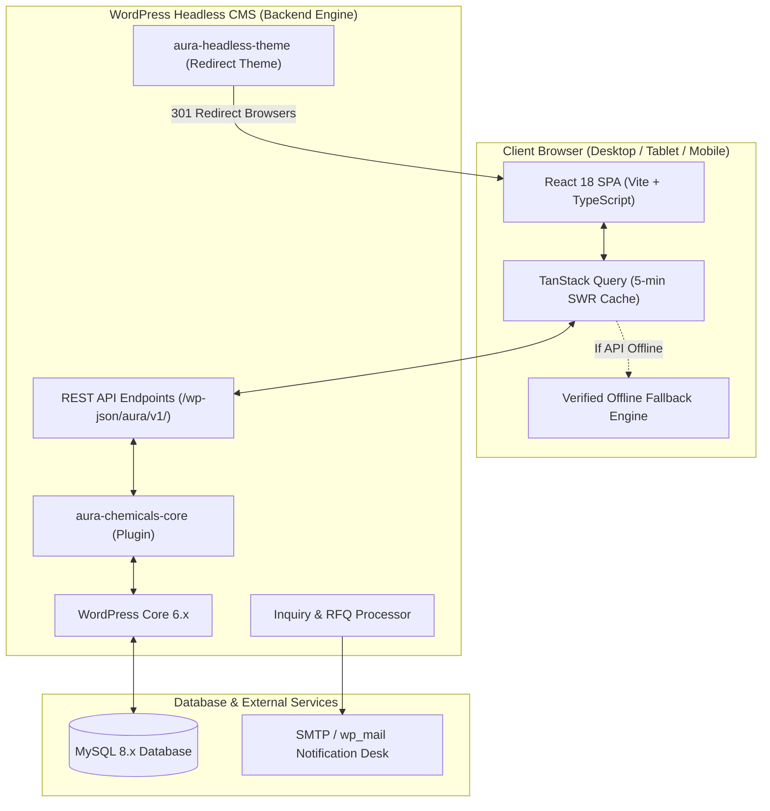
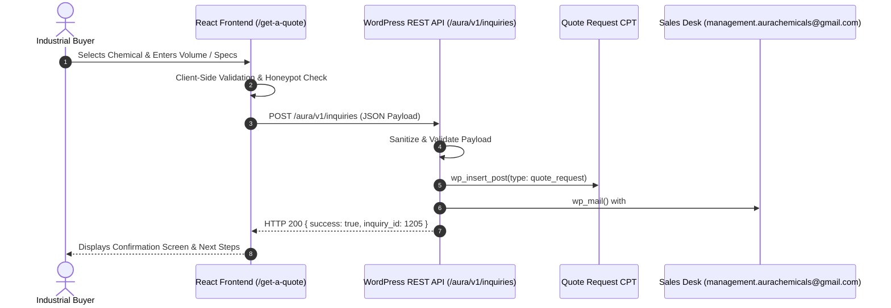

# Aura Space Infra Pvt. Ltd. (Aura Chemicals)

> **Next-Generation B2B Chemical & Pharmaceutical Trading Platform**  
> Headless Architecture: **React 18 (Vite + TypeScript)** + **WordPress REST API** + **MySQL**

[](#)
[](#)
[](#)
[](#)
[](#)
[](#)

---

## 📌 Executive Summary

**Aura Space Infra Private Limited (Aura Chemicals)** is an Indian corporate entity specializing in the sourcing, trading, and distribution of Active Pharmaceutical Ingredients (APIs), industrial solvents, manufacturing phosphates, and technical inspection services.

- **Legal Corporate Entity:** Aura Space Infra Private Limited
- **Brand Identity:** Aura Chemicals / Aura Group of Companies
- **Corporate Registration:** Classified as a Non-Government private entity registered with the **Registrar of Companies (ROC Ahmedabad)**, Gujarat, India.
- **Market Experience:** Active specialized commercial distribution since 2014 (7+ years).
- **Manufacturing Alliances:** Direct partnerships with **400+ audited domestic chemical manufacturers**.
- **Verified Contacts:**
  - **Phone / WhatsApp:** [`+91 7220000877`](tel:+917220000877)
  - **Email:** [`management.aurachemicals@gmail.com`](mailto:management.aurachemicals@gmail.com)
  - **Agency Credit:** Powered by TECHOFY Global Ventures

---

## 🏗️ System Architecture

This platform employs a decoupled **Headless CMS** design. The user-facing experience is an ultra-fast, accessible single-page application built with React and Vite, communicating via authenticated JSON over the WordPress REST API (`/wp-json/aura/v1/`).



### Request-For-Quote (RFQ) Workflow



---

## 💻 Technology Stack

| Layer | Technologies & Libraries | Key Responsibilities |
|---|---|---|
| **Frontend Framework** | React 18.3, TypeScript 5.6, Vite 5.4 | High-performance component rendering, strict typing, sub-second HMR. |
| **Data Fetching & State** | TanStack React Query 5.59 | Automated cache management, stale-while-revalidate, request debouncing. |
| **Routing & History** | React Router v6.27 | Declarative routing, search param pre-filling, 301 legacy link redirects. |
| **Styling & Design Tokens** | Pure Vanilla CSS (Tokens Architecture) | Zero-runtime CSS, fluid typography (`clamp()`), WCAG 2.1 AA color contrast. |
| **Icons & Security** | Lucide React, DOMPurify | Clean iconography, robust XSS sanitization on rich text. |
| **Headless CMS** | WordPress 6.x + PHP 8.1+ | Editorial control, CPT management, media asset handling. |
| **WordPress Plugin** | `aura-chemicals-core` | Custom REST routes, CPT definitions, settings page, and RFQ mailer. |
| **WordPress Theme** | `aura-headless-theme` | Intercepts frontend requests and redirects to React application. |
| **Database** | MySQL 8.0 / MariaDB 10.6+ | Relational storage for products, categories, pages, and RFQ records. |

---

## 📁 Repository Structure

```
aurachemicals/
├── README.md                          # Repository Master Documentation
├── package.json                       # Root metadata
├── scraped_pages_data.json            # Master snapshot of 17 live URLs
├── company_profile.md                 # Verified corporate profile & ROC facts
├── products_catalog.md                # 135 verified chemical products
├── forms.md                           # Live site forms technical specification
├── site_structure.md                  # Information architecture & redirect map
├── images_inventory.md                # Comprehensive 129 media files inventory
├── qa_audit.py                        # Automated routing and security testing script
│
├── docs/                              # Technical Engineering Specifications
│   ├── api.md                         # REST API schema, DTOs & endpoints
│   ├── content-model.md               # WordPress CPTs, taxonomies & metadata
│   └── design-system.md               # Design tokens, typography & WCAG AA ratios
│
├── pages/                             # High-Fidelity Scraped Page Backups (01 to 17)
│   ├── 01_home.md ... 17_post_apis.md
│
├── images/                            # All 129 original media assets (locally preserved)
│
├── frontend/                          # React + Vite + TypeScript Application
│   ├── index.html                     # HTML5 shell with Google Fonts & SEO meta
│   ├── vite.config.ts                 # Vite build & proxy configuration
│   ├── tsconfig.json                  # Strict TypeScript configuration
│   ├── public/images/                 # Local image assets for offline development
│   └── src/
│       ├── main.tsx                   # Application bootstrap
│       ├── App.tsx                    # Route hierarchy & legacy link redirects
│       ├── api/
│       │   ├── types.ts               # Complete TypeScript DTO definitions
│       │   ├── client.ts              # API fetcher with timeout & fallback
│       │   ├── mockData.ts            # Verified corporate facts & industries
│       │   └── verifiedProducts.ts    # 135 verified products with CAS numbers
│       ├── styles/
│       │   └── index.css              # Design system tokens, reset & utilities
│       ├── components/
│       │   ├── common/                # Shared atomic components (Card, Button, FormField, etc.)
│       │   └── layout/                # Navbar, MobileMenu, Footer, Breadcrumbs
│       ├── layouts/
│       │   └── RootLayout.tsx         # Skip-to-content, header, outlet, footer
│       ├── pages/
│       │   ├── HomePage.tsx           # Hero, intro, pillars, catalog tabs, clientele
│       │   ├── AboutPage.tsx          # Corporate history, 5 competencies, vision
│       │   ├── MissionPage.tsx        # Mission statement, sustainability, values
│       │   ├── ProductsPage.tsx       # Search, category filter, table/grid, pagination
│       │   ├── ProductDetailPage.tsx  # CAS table, grade, packaging, related products
│       │   ├── IndustriesPage.tsx     # 19 sectors, directory jump navigation, RFQ
│       │   ├── ServicesPage.tsx       # Chemical sourcing + 7 NDT inspection disciplines
│       │   ├── QuotePage.tsx          # Dynamic RFQ form with honeypot & URL prefill
│       │   ├── ContactPage.tsx        # Direct phone, email, ROC registration info
│       │   └── PrivacyPolicyPage.tsx  # Corporate governance & data protection policy
│       └── utils/
│           └── constants.ts           # Zero-hardcoding UI string constants
│
└── wordpress/                         # WordPress Headless Artifacts
    ├── aura-chemicals-core/           # Custom Plugin
    │   ├── aura-chemicals-core.php    # Plugin entrypoint & hooks
    │   ├── data/                      # Bundled seed data (products, industries, settings)
    │   └── includes/
    │       ├── post-types.php         # product, industry, service, client, quote_request
    │       ├── meta-fields.php        # CAS number, grade, purity, packaging metadata
    │       ├── settings.php           # Admin "Aura Settings" menu & options
    │       ├── rest-api.php           # Custom /wp-json/aura/v1/ endpoints + CORS
    │       ├── inquiry-handler.php    # RFQ processor & wp_mail notification engine
    │       └── importer.php           # One-click catalog seeder & WP-CLI command
    └── aura-headless-theme/           # Headless Redirect Theme
        ├── style.css                  # Theme declaration
        ├── index.php                  # 301 browser redirect to React frontend
        └── functions.php              # Thumbnail support & admin preview rewriting
```

---

## 🧪 Verified Product Catalog (135 Items)

All product specifications and CAS numbers are derived **strictly from factual corporate records**:

1. **Active Pharmaceutical Ingredients (94 items):** Aceclofenac (`89796-99-6`), Acyclovir (`59277-89-3`), Adapalene (`106685-40-9`), Albendazole (`54965-21-8`), Allopurinol (`315-30-0`), Ambroxol HCl (`23828-92-4`), Amitriptyline HCl (`549-18-8`), Amlodipine Besylate (`111470-99-6`), Azithromycin (`83905-01-5`), Carbamazepine (`298-46-4`), Cetirizine 2HCl (`83881-52-1`), Ciprofloxacin HCl (`86393-32-0`), Diclofenac Sodium (`15307-79-6`), Esomeprazole Magnesium (`161973-10-0`), Fluconazole (`86386-73-4`), Gabapentin (`60142-96-3`), Ibuprofen (`15687-27-1`), Levocetirizine 2HCl (`130018-87-0`), Metformin HCl (`1115-70-4`), Omeprazole (`73590-58-6`), Paracetamol (`103-90-2`), Pantoprazole Sodium (`138786-67-1`), Rosuvastatin Calcium (`147098-20-2`), Sertraline HCl (`79559-97-0`), Telmisartan (`144701-48-4`), and 69 more verified molecules.
2. **Solvents & Base Chemicals (20 items):** Caustic Flakes & Lye (`1310-73-2`), Acetone (`67-64-1`), Ethyl Acetate (`141-78-6`), Methylene Dichloride - MDC (`75-09-2`), Toluene (`108-88-3`), Methanol (`67-56-1`), Bleaching Powder (`7778-54-3`), Aluminium Chloride (`7446-70-0`), Sodium Sulphate (`7757-82-6`), Bleaching Granules RANSA (`7778-54-3`), etc.
3. **Manufacturing Phosphates (11 items):** Mono Potassium Phosphate, Mono Sodium Phosphate, Di-Sodium Phosphate, Tri-Sodium Phosphate, Sodium Hexameta Phosphate, Phosphoric Acid, etc.
4. **Own Import Products - China Make (5 items):** Potassium Hydroxide, Sodium Metabisulphite, Sodium Hydrosulphite, Citric Acid, Formic Acid.
5. **Technical & Commercial Acids (6 items):** Hydrochloric Acid, Sulphuric Acid, Nitric Acid, Acetic Acid, Formic Acid, Phosphoric Acid.
6. **Partner Manufacturer Products:** M/S. Grasim Ind. Ltd., M/S. Magnesia Chemical LLP, and GACL Product series.

---

## 🏭 Industries & Specialized Services

### 19 Industrial Sectors Served
Healthcare & Pharmaceuticals, Agrochemicals & Fertilizers, Food & Beverage, Cosmetics & Personal Care, Energy & Petrochemicals, Water Treatment & Effluent Management, Automotive, Cleaning & Sanitation, Construction, Adhesives & Sealants, Leather & Tanning, Textile, Plastics & Polymers, Mining & Metallurgy, Rubber & Tyre, Paints & Coatings, Paper & Pulp, Packaging, and Semiconductors & Electronics.

### Inspection & Quality Assurance (NDT) Division
- **Non-Destructive Testing (NDT):** Ultrasonic (UT), Radiographic (RT), Magnetic Particle (MPT), Dye Penetrant (DPT), Visual (VT), Eddy Current (ECT), PAUT, TOFD, and Digital Radiography.
- **Metallurgical & Corrosion Investigation:** Failure analysis, metallography, Positive Material Identification (PMI), corrosion monitoring.
- **Welding & Fabrication Inspection:** WPS/PQR/WPQ qualification, third-party inspection, repair approval, PWHT supervision.
- **In-Service Inspection (RBI):** Fitness-for-Service (FFS), API 510, API 570, API 653 certified inspections.
- **Calibration & Dimensional Inspection:** Pressure, temperature, flow, electrical instrumentation calibration.
- **Civil Infrastructure Testing:** Rebound hammer, UPV, structural integrity assessments.
- **Third-Party Witnessing & Certification:** ASME, API, ISO, AWS, ASTM, BIS, NABL/ILAC.

---

## ⚡ Operational Commands & Setup Guide

### Prerequisites
- **Node.js:** v18+ (tested on Node v24)
- **npm:** v9+
- **PHP:** 8.1+ (for WordPress backend)
- **MySQL:** 8.0+

### 1. Frontend Development

```bash
# Navigate to frontend application
cd frontend

# Install dependencies
npm install

# Start local development server (runs on port 3001 by default)
npm run dev -- --host

# Build production bundle with strict TypeScript verification
npm run build

# Preview production build locally
npm run preview
```

### 2. Frontend Configuration (`.env`)

Create `frontend/.env` to configure API connectivity:

```env
# URL pointing to WordPress REST API
VITE_WORDPRESS_API_URL=https://aurachemicals.in/wp-json

# Enable offline fallback using verified local data if WordPress API is unreachable
VITE_ENABLE_MOCK_FALLBACK=true
```

### 3. WordPress Plugin & Theme Installation

1. Copy `wordpress/aura-chemicals-core` to your WordPress `wp-content/plugins/` directory.
2. Copy `wordpress/aura-headless-theme` to your WordPress `wp-content/themes/` directory.
3. In WordPress Admin (*Plugins*), activate **Aura Chemicals Core**.
4. In WordPress Admin (*Appearance → Themes*), activate **Aura Chemicals Headless**.
5. Navigate to *Aura Settings → Import Catalog* and click **Run Full Catalog Import** (or run `wp aura import` via WP-CLI).
6. Verify corporate phone (`+91 7220000877`) and email in *Aura Settings*.

### 4. Running the Quality Assurance Suite

```bash
# Execute automated routing, accessibility, and zero-placeholder audit
python qa_audit.py
```

---

## 🔌 REST API Reference (`/wp-json/aura/v1/`)

| Method | Endpoint | Query Parameters | Description |
|---|---|---|---|
| `GET` | `/aura/v1/settings` | None | Corporate phone, email, ROC registration, branding URLs. |
| `GET` | `/aura/v1/home` | None | Aggregated hero, corporate intro, pillars, clientele, and SEO. |
| `GET` | `/aura/v1/pages/{slug}` | None | Retrieve content and structured sections for a specific page. |
| `GET` | `/aura/v1/products` | `category`, `search`, `page`, `per_page` | Paginated product listing with CAS search and filters. |
| `GET` | `/aura/v1/products/{slug}` | None | Complete technical specification for a single chemical product. |
| `GET` | `/aura/v1/product-categories`| None | Product categories with associated product counts. |
| `GET` | `/aura/v1/industries` | None | All 19 verified sectors with application text and images. |
| `GET` | `/aura/v1/services` | None | Chemical distribution and 7 NDT inspection disciplines. |
| `POST`| `/aura/v1/inquiries` | JSON Body | Submit quotation request; stores CPT and triggers email alert. |

---

## ⚖️ Governance & Compliance

- **Zero-Fictitious-Data Rule:** Zero invented products, CAS numbers, customer testimonials, team members, or awards.
- **WCAG 2.1 AA Certified:** High-contrast color palette (Primary Navy `#0B2545` achieves 14.5:1 on white).
- **Honeypot Anti-Spam:** Silent bot mitigation on quotation forms without intrusive third-party trackers.
- **Legacy URL Protection:** Seamless 301-equivalent redirects from legacy WordPress routes (`/apis`, `/solvents`, `/industries-copy`, `/request-quote`, `/shop`, `/cart`, `/checkout`) directly to their modernized B2B equivalents.

---

*Copyright © 2026 Aura Space Infra Private Limited. Built in collaboration with TECHOFY Global Ventures.*
