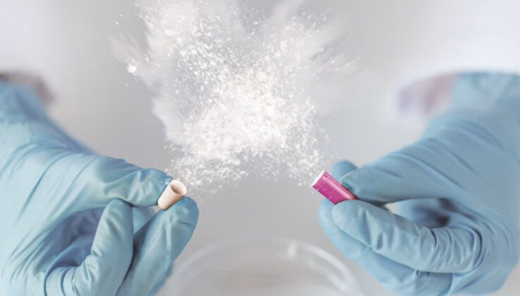
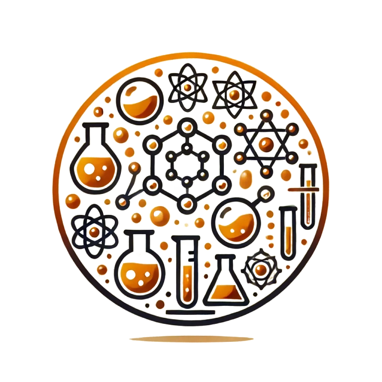
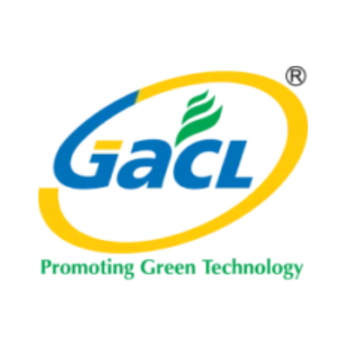
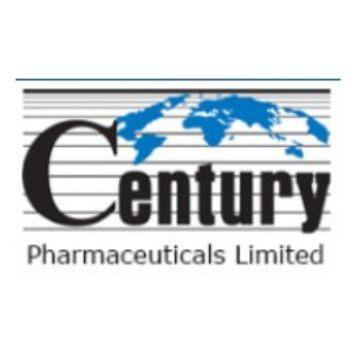
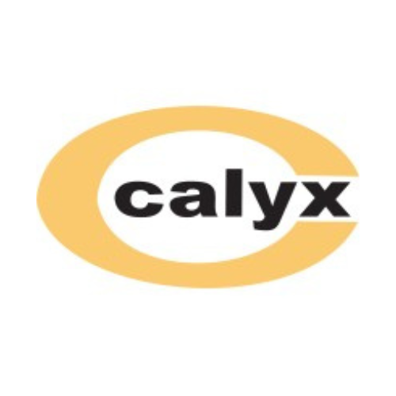

# Home — Aura Space Infra Pvt. Ltd.

> **Source URL:** [https://aurachemicals.in/](https://aurachemicals.in/)  
> **WordPress Page ID:** 27  
> **Status:** Published / Active Homepage  
> **Last Modified:** 2025-08-26T11:28:32  

---

## 1. Page Header & Navigation
- **Website Brand:** Aura Group of Companies / Aura Space Infra Pvt. Ltd.
- **Top Navigation Menu:**
  - [Home](file:///c:/Users/HP/OneDrive/Desktop/technofy%20office%20work/aurachemicals/pages/01_home.md)
  - [About Us](file:///c:/Users/HP/OneDrive/Desktop/technofy%20office%20work/aurachemicals/pages/02_about_us.md)
  - [Our Mission](file:///c:/Users/HP/OneDrive/Desktop/technofy%20office%20work/aurachemicals/pages/03_our_mission.md)
  - [Products](file:///c:/Users/HP/OneDrive/Desktop/technofy%20office%20work/aurachemicals/pages/04_products.md)
    - [API](file:///c:/Users/HP/OneDrive/Desktop/technofy%20office%20work/aurachemicals/pages/05_apis.md)
    - [Solvents](file:///c:/Users/HP/OneDrive/Desktop/technofy%20office%20work/aurachemicals/pages/06_solvents.md)
  - [Industries](file:///c:/Users/HP/OneDrive/Desktop/technofy%20office%20work/aurachemicals/pages/07_industries.md)
  - [Get a Quote](file:///c:/Users/HP/OneDrive/Desktop/technofy%20office%20work/aurachemicals/pages/08_get_a_quote.md)

---

## 2. Hero Section
- **Subtitle:** Aura Group of Companies
- **Main Heading:** Aura Space Infra Pvt. Ltd.
- **Tagline:** *Your trusted partner in Chemical Excellence*
- **Call-to-Action:** [Explore More](file:///c:/Users/HP/OneDrive/Desktop/technofy%20office%20work/aurachemicals/pages/02_about_us.md)

---

## 3. Our Company Overview
> The company has received a highly regarded reputation for reliable and quality suppliers and services from many decades of experiences in the market, long-term close relationship with customers, and thus a deep understanding of customer needs.

---

## 4. Our Services
- **Assured Quality & Security:** Assured quality and security in API supplies via 400+ leading suppliers around India.
- **Client Base:** Active with many thousands of customers across multiple industries.
- **Direct Domestic Sourcing:** Direct sourcing from domestic manufacturers with expertise in chemistry. The company can efficiently secure supplies, create customized compounds, and deliver high-quality products to customers.

---

## 5. Our Core Product Lines
- **Solvents:** High-purity industrial and pharmaceutical solvents.
- **API (Active Pharmaceutical Ingredients):** Comprehensive range of certified APIs.
- **Call-to-Action Button:** [Explore Now](file:///c:/Users/HP/OneDrive/Desktop/technofy%20office%20work/aurachemicals/pages/05_apis.md)

---

## 6. Value Proposition & Key Pillars

### Wide Range of Products
Aura Chemicals offers a diverse portfolio of chemical solutions catering to various industries. Whether you're in manufacturing, agriculture, or healthcare, we have the right products to meet your specific needs.

### Competitive Pricing
Experience affordability without compromising quality. Aura Chemicals offers competitive pricing, making our products accessible to businesses of all sizes.

### Reliable Supply Chain
Count on a consistent and reliable supply chain when you choose Aura Chemicals. We understand the importance of timely deliveries, ensuring that your operations run smoothly without interruptions.

### Extensive Network & Corporate Registration
Through experiences over 7 years since 2014 in the API distribution business. It is classified as a Non-Government company and is registered at the **Registrar of Companies (ROC) Ahmedabad**.

---

## 7. Our Clientele
> **Together We Can Make Awesome Memories**
Aura Chemicals partners with leading chemical and pharmaceutical manufacturing leaders across India.

---

## 8. Closing Call-to-Action
> **Join Us on the Journey to Excellence**  
> Whether you're a small-scale enterprise or a large industrial player, Aura Chemicals Pvt Ltd invites you to join us on the journey to excellence. Experience the reliability, innovation, and customer satisfaction that have made us a trusted name in chemical trading.  
> At Aura Chemicals Pvt Ltd, we go beyond trading chemicals; we forge partnerships, empower industries, and contribute to a future of sustainable growth. Choose us as your preferred chemical trading partner, and let's build success together.

- **Destination Button:** [Your Destination](file:///c:/Users/HP/OneDrive/Desktop/technofy%20office%20work/aurachemicals/pages/04_products.md)

---

## 9. Footer Details
- **Copyright:** Copyright © 2026 Aura Space Infra . Ltd.
- **Powered by:** TECHOFY Global Ventures

---

## 10. Images on This Page
| Image Preview | Filename | Alt Text | Dimensions | Original Source |
|---|---|---|---|---|
|  | `cropped-Orange_Gray_Modern_Elegant_Corporate_Business_Card-removebg-preview-1-1.png` | Aura Chemicals Logo | 185x58 | [Source](https://aurachemicals.in/wp-content/uploads/2024/01/cropped-Orange_Gray_Modern_Elegant_Corporate_Business_Card-removebg-preview-1-1.png) |
|  | `pexels-pixabay-247763-1024x683.jpg` | Laboratory Equipment Banner | 1024x683 | [Source](https://aurachemicals.in/wp-content/uploads/2024/10/pexels-pixabay-247763-1024x683.jpg) |
|  | `solvents.png` | Solvents Product Line | 1024x1024 | [Source](https://aurachemicals.in/wp-content/uploads/2024/12/solvents.png) |
|  | `apis.jpg` | API Active Pharmaceutical Ingredients | 1024x1024 | [Source](https://aurachemicals.in/wp-content/uploads/2024/12/apis.jpg) |
|  | `dalle_circular_logo.webp` | Aura Chemical Emblem | 1024x1024 | [Source](https://aurachemicals.in/wp-content/uploads/2024/12/DALL·E_2024-12-14_12.10.20_-_A_circular_logo_design_with_a_clean_and_modern_aesthetic__using_shades_of_orange_and_golden_colors._The_logo_features_a_variety_of_abstract_chemical_r-transformed.webp) |
|  | `supply.png` | Reliable Supply Chain Icon | 512x512 | [Source](https://aurachemicals.in/wp-content/uploads/2024/12/supply.png) |
|  | `earth-4-removebg-preview-260x300.png` | Global Earth Network | 260x300 | [Source](https://aurachemicals.in/wp-content/uploads/2024/12/earth-4-removebg-preview-260x300.png) |
|  | `1.png` | Client Partner 1 | 300x150 | [Source](https://aurachemicals.in/wp-content/uploads/2024/12/1.png) |
|  | `2.png` | Client Partner 2 | 300x150 | [Source](https://aurachemicals.in/wp-content/uploads/2024/12/2.png) |
|  | `3.png` | Client Partner 3 | 300x150 | [Source](https://aurachemicals.in/wp-content/uploads/2024/12/3.png) |
|  | `4.png` | Client Partner 4 | 300x150 | [Source](https://aurachemicals.in/wp-content/uploads/2024/12/4.png) |
|  | `5.png` | Client Partner 5 | 300x150 | [Source](https://aurachemicals.in/wp-content/uploads/2024/12/5.png) |
|  | `6.png` | Client Partner 6 | 300x150 | [Source](https://aurachemicals.in/wp-content/uploads/2024/12/6.png) |
|  | `7.png` | Client Partner 7 | 300x150 | [Source](https://aurachemicals.in/wp-content/uploads/2024/12/7.png) |
|  | `8.png` | Client Partner 8 | 300x150 | [Source](https://aurachemicals.in/wp-content/uploads/2024/12/8.png) |
