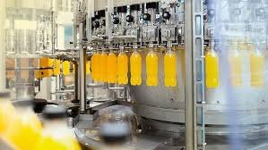
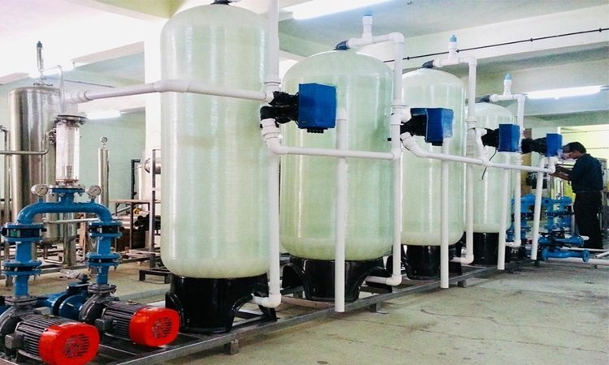
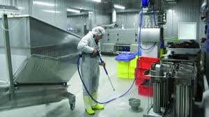
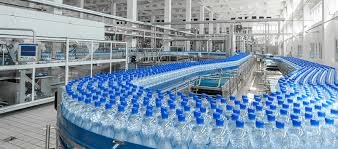
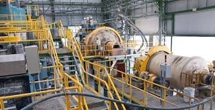
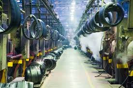
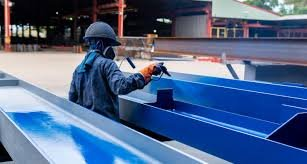
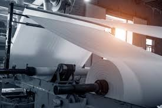
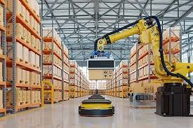

# Industries Served — Aura Space Infra Pvt. Ltd.

> **Source URL:** [https://aurachemicals.in/industries-copy/](https://aurachemicals.in/industries-copy/)  
> **WordPress Page ID:** 864  
> **Status:** Published  

Aura Space Infra Pvt. Ltd. serves over 19 diverse industrial sectors across India and global markets.

---

## 1. Healthcare & Pharmaceutical Industry

At Aura Chemicals, we are dedicated to advancing the healthcare and pharmaceutical sector by supplying high-purity APIs, intermediates, and specialty chemicals. Our products comply with stringent regulatory standards, ensuring safety, efficacy, and consistency in pharmaceutical formulations. We support the development of life-saving medications and healthcare solutions, helping our partners meet critical health challenges globally.

---

## 2. Agrochemicals & Fertilizers

We provide high-quality chemicals essential for the formulation of pesticides, herbicides, and fertilizers. Our agrochemical solutions are tailored to enhance crop yield, protect against pests and diseases, and improve soil fertility. By supporting modern agricultural practices, Aura Chemicals plays a pivotal role in promoting food security and sustainable farming.

---

## 3. Food and Beverage Industry

Our portfolio includes food-grade chemicals, additives, preservatives, and acidulants that comply with international food safety standards. We enable food manufacturers to improve shelf life, enhance flavor profiles, and maintain the texture and appearance of their products, ensuring safe and high-quality food for consumers.

---

## 4. Cosmetics and Personal Care

Aura Chemicals supplies specialized raw materials, including emulsifiers, preservatives, surfactants, and active ingredients, to the cosmetics and personal care sector. Our ingredients help formulate safe, high-performing skincare, haircare, and personal hygiene products that meet the growing consumer demand for quality and sustainability.

---

## 5. Energy Sector & Oil/Gas

Aura Chemicals provides essential chemical solutions tailored to the unique demands of the energy sector. From specialty chemicals for oil and gas extraction and refining to products supporting renewable energy technologies, we deliver high-performance solutions that enhance operational efficiency and environmental compliance.

---

## 6. Water Treatment & Environmental Management

We offer a comprehensive range of water treatment chemicals, including coagulants, flocculants, disinfectants, biocides, and scale inhibitors. These chemicals are critical for treating municipal and industrial wastewater, ensuring safe drinking water, and meeting environmental compliance standards for effluent discharge.

---

## 7. Automotive Industry

Aura Chemicals provides high-performance chemicals used in automotive manufacturing and maintenance. From coatings and adhesives to specialty fluids, coolants, and cleaners, our solutions contribute to the durability, safety, and efficiency of modern vehicles.

---

## 8. Cleaning and Sanitation Industry

Our diverse portfolio includes disinfectants, surfactants, and sanitizing agents designed for industrial, commercial, and household cleaning. These chemicals ensure optimal hygiene and cleanliness, supporting sanitation standards in hospitals, institutions, and homes.

---

## 9. Construction Industry

Aura is a trusted partner for the construction industry, offering a wide range of high-performance chemicals designed to enhance building materials and construction processes. Our products include concrete additives, waterproofing agents, sealants, accelerators, and retarders that improve the durability, strength, and workability of construction materials.

---

## 10. Adhesives and Sealants Industry

We supply high-performance resins, polymers, plasticizers, and solvents that improve bonding strength, flexibility, and resistance to environmental stress. Our solutions cater to packaging, construction, woodworking, and automotive industries.

---

## 11. Leather and Tanning Industry

We provide high-quality chemicals essential for beamhouse, tanning, and finishing processes. Our products help produce soft, durable, and weather-resistant leather while supporting eco-friendly tanning solutions.

---

## 12. Textile Industry

Our comprehensive range of chemicals is tailored to meet the needs of textile processing, from pre-treatment, dyeing, and printing to finishing. We provide eco-friendly solutions that ensure vibrant colors, soft hand-feel, and durable fabrics.

---

## 13. Plastics and Polymers Industry

Our portfolio includes plasticizers, stabilizers, additives, and catalysts that improve the flexibility, durability, and strength of plastic products across packaging, construction, and consumer goods.

---

## 14. Mining and Metallurgy

We offer flotation agents, leaching chemicals, corrosion inhibitors, and solvent extraction reagents designed to optimize mineral extraction, ore refining, and treatment of mining by-products.

---

## 15. Rubber and Tyre Industry

Supplying vulcanizing agents, accelerators, fillers, antioxidants, and specialty additives that enhance elasticity, tensile strength, and heat resistance in rubber and tyre formulations.

---

## 16. Paints and Coatings Industry

Resins, binders, pigments, solvents, and additives that improve color retention, durability, texture, adhesion, and weather resistance for industrial, decorative, and automotive finishes.

---

## 17. Paper and Pulp Industry

Chemicals for pulping, bleaching, sizing, and water treatment that enhance paper strength, brightness, and manufacturing runnability.

---

## 18. Packaging Industry

Barrier coatings, adhesives, and polymer additives that enhance the strength, shelf life, and sustainability of rigid and flexible packaging materials.

---

## 19. Semiconductors and Electronics

Ultra-high-purity chemical reagents, etchants, and cleaning solvents engineered for semiconductor wafer fabrication and electronic component manufacturing.
